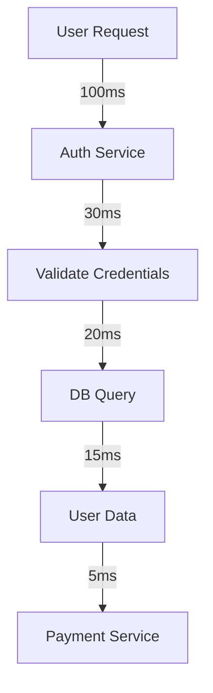

## Distributed Tracing

Distributed tracing is the cornerstone of modern observability in complex distributed systems. It provides a unified way to visualize and analyze the flow of requests across microservices, identify performance bottlenecks, and diagnose failures in real time. Without it, debugging distributed systems becomes a frustrating guessing game—like trying to assemble a jigsaw puzzle with your eyes closed. 😊

### Why Distributed Tracing Matters

Imagine a user request traveling through 15 microservices. Traditional logging shows individual service logs, but they’re disconnected in time and space. Distributed tracing solves this by creating a **single, continuous thread** of the request journey—called a *trace*—that links all interactions from start to finish. This lets you:

- Identify latency hotspots (e.g., a slow database call)
- Pinpoint failures (e.g., a service crashing mid-request)
- Visualize service dependencies
- Quantify end-to-end performance metrics

In essence, tracing transforms chaotic distributed systems into a single, navigable story.

### Core Concepts

#### Traces

A **trace** is a single, high-level representation of a request’s journey through your system. Think of it as a "request timeline" that spans multiple services. Each trace has a unique *trace ID* (e.g., `a1b2c3d4e5f6`) that links all related spans.

#### Spans

A **span** is a logical unit of work within a trace. It represents a specific operation (e.g., "user authentication" or "database query") and has:
- A *span ID* (unique within the trace)
- A *parent span ID* (links to the calling span)
- *Start time* and *duration*
- *Status* (success/failure)
- *Attributes* (metadata like error codes, response times)

Spans are nested hierarchically. For example:
```
User Login Request
├─ Authentication Service (span 1)
│  ├─ Validate Credentials (span 2)
│  └─ Database Query (span 3)
└─ Payment Service (span 4)
```

#### Service and Context Propagation

For traces to work across services, **context propagation** is critical. This is how trace IDs travel between services without being lost. Modern systems use standardized protocols like:
- **W3C Trace Context** (HTTP headers: `X-Trace-Id`, `X-Trace-Span-Id`)
- **OpenTelemetry** (via distributed tracing contexts)

When a service receives a request, it:
1. Extracts the trace ID from the incoming request
2. Creates a new span with that trace ID
3. Sends the new span’s ID and trace ID in outgoing requests

This ensures all services in the chain share the same trace.

### Setting Up Tracing: A Practical Example

Let’s build a minimal tracing pipeline using **OpenTelemetry** (the industry-standard open-source framework). We’ll instrument a simple Node.js service that calls a database.

```javascript
const { Tracer } = require('@opentelemetry/javascript');
const { JaegerExporter } = require('@opentelemetry/exporter-jaeger');

// Initialize tracer
const tracer = new Tracer({
  exporter: new JaegerExporter({ serviceName: 'user-service' }),
  // Optional: Add custom processors for error handling
});

// Example: User login handler
async function handleLogin(request) {
  const traceId = request.headers['x-trace-id']; // Extract trace context
  const span = tracer.startSpan('user-login', { traceId });

  try {
    // Step 1: Validate credentials
    const credentials = await validateCredentials(request.body);
    // Step 2: Call database
    const user = await db.query(`SELECT * FROM users WHERE email = ${credentials.email}`);
    
    // Record success
    span.setStatus('OK');
    span.addEvent('Credentials validated');
    span.end();
    
    return user;
  } catch (error) {
    // Record failure
    span.setStatus('ERROR');
    span.addEvent(`Failed: ${error.message}`);
    span.end();
    throw error;
  }
}

// Export the tracer to Jaeger (for visualization)
tracer.register();
```

**What this does**:
1. Uses `X-Trace-Id` header to inherit trace context
2. Creates a `user-login` span
3. Logs events at critical points
4. Sends span data to Jaeger for real-time visualization

### Analyzing Traces: From Debugging to Performance

With traces in place, you gain actionable insights through **trace visualization**:

#### Finding Performance Bottlenecks


In this example, the database query (`D`) is the slowest step (20ms vs. 15ms for the next step). You’d immediately know to optimize the query.

#### Diagnosing Failures
When a service fails, traces show *why*:
- `span.status = 'ERROR'` indicates failure
- `span.events` reveal the failure point (e.g., "DB connection timeout")
- **Root cause analysis** becomes possible by tracing the failure path backward

#### Real-World Scenario: A Payment Failure
Imagine a user fails to pay:
1. Trace shows the payment span (`span 4`) has `status = 'ERROR'`
2. `span.events` reveal: `Failed: Database connection timeout`
3. You realize the database is overloaded → scale the database or add retries

### Best Practices and Pitfalls

#### ✅ Best Practices
1. **Always propagate trace context** – Never lose trace IDs between services.
2. **Use semantic conventions** – Standardize span names (e.g., `user.login`) for consistency.
3. **Instrument critical paths** – Focus on user-facing flows (not internal service calls).
4. **Centralize tracing** – Use a single backend (e.g., Jaeger, Datadog) for all traces.

#### ⚠️ Common Pitfalls
| Pitfall | Consequence | Fix |
|---------|-------------|-----|
| Inconsistent trace IDs | Traces split across services | Enforce W3C Trace Context headers |
| Missing span events | No context for failures | Add `status` and `events` to spans |
| Too many spans | Overwhelming trace data | Limit spans to 1-2 per service call |

> 💡 **Pro Tip**: Start with a *single service* before scaling. Trace 100 requests across 3 services—then expand. You’ll avoid cognitive overload.

### Summary

Distributed tracing transforms distributed systems from opaque black boxes into transparent, debuggable ecosystems. By capturing end-to-end request journeys as traces and breaking them into meaningful spans, you gain unprecedented visibility into performance, failures, and dependencies. With OpenTelemetry as your foundation and tools like Jaeger for visualization, you can quickly identify bottlenecks, diagnose errors, and build resilient systems that scale without sacrificing observability. Remember: **tracing isn’t just about logs—it’s about telling the story of your system**. 🚀