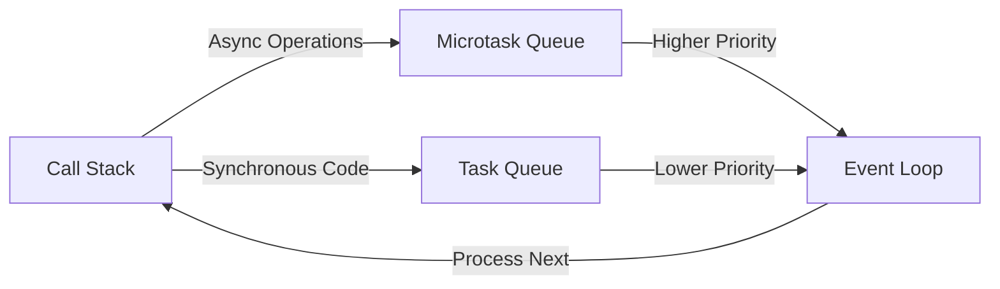

## How JavaScript Works

JavaScript isn't just a language—it's the engine that powers the dynamic behavior of modern web applications. Understanding *how* it works reveals why your browser feels responsive despite its asynchronous nature. Let's dive into the foundational mechanics that make JavaScript so powerful and elegant.

### Browser Engines

Before JavaScript can run, it needs a **browser engine**—a specialized software layer that interprets and executes JavaScript code within your browser. Think of it as the "brain" that translates your JavaScript instructions into visual and interactive experiences. Different browsers use distinct engines, each with unique optimizations:

| Engine | Primary Browser | Key Features | Example Use Case |
|--------|-----------------|---------------|------------------|
| **V8** | Chrome, Edge | Fast JIT compilation, WebAssembly support | Real-time apps, large-scale web services |
| **WebKit** | Safari, iOS | Foundation for modern web standards | Mobile-first experiences, touch interfaces |
| **SpiderMonkey** | Firefox | Optimized for security, extensive debugging | Privacy-focused applications |
| **Chakra** | Microsoft Edge (legacy) | Lightweight, good for mobile | Older Windows-based apps |

**Why this matters**: When you type `console.log("Hello")` in Chrome, it’s the V8 engine that processes your code. This engine’s efficiency directly impacts how quickly your web app responds—especially critical for complex applications like real-time chat systems or data visualizations.

Here’s a concrete example demonstrating engine differences:
```javascript
// Simple test to compare engine performance (run in browser console)
const measure = (code) => {
  const start = performance.now();
  eval(code);
  return performance.now() - start;
};

// V8 (Chrome) vs. WebKit (Safari) timing
console.log(`V8 timing: ${measure("for (i=0; i<1000000; i++) { }")}`); 
console.log(`WebKit timing: ${measure("for (i=0; i<1000000; i++) { }")}`);
```

### JavaScript Runtime

The **JavaScript Runtime** is the environment where JavaScript code executes. It’s not just the engine—it’s the entire system that manages memory, handles exceptions, and provides access to browser APIs. Think of it as the "stage" where your JavaScript code performs its work.

Key components of the runtime include:
- **Global Object**: The `window` object in browsers (or `global` in Node.js)
- **Execution Context**: The current environment where code is running (e.g., a function call)
- **Memory Management**: Heap for variables, stack for function calls
- **APIs**: Browser-specific interfaces (e.g., `fetch`, `DOM`)

When you write `alert("Hello")`, the runtime:
1. Creates an execution context
2. Resolves `alert` from the browser’s API registry
3. Executes the code in the global context

**Practical demonstration**: Let’s see how the runtime handles asynchronous operations:
```javascript
// Shows runtime context in action
console.log("Starting...");
setTimeout(() => {
  console.log("This runs after 1 second (runtime event handling)");
}, 1000);
console.log("Ending...");
```

**Output**:
```
Starting...
Ending...
This runs after 1 second (runtime event handling)
```

This example reveals how the runtime *separates* synchronous code (`Starting...`, `Ending...`) from asynchronous operations (`setTimeout`).

### Single-threaded Nature

JavaScript runs on a **single thread**—a critical design choice that balances security, simplicity, and performance. This means only one operation can execute at a time (unlike multi-threaded systems where multiple tasks run concurrently).

**Why single-threaded?**
- **Security**: Prevents race conditions and memory corruption
- **Predictability**: Easier to debug and reason about code flow
- **Resource efficiency**: Avoids costly context switches

**Real-world impact**: Without single-threading, your web app could crash if two operations tried to modify the same data simultaneously (e.g., two users updating a shared counter). Instead, JavaScript uses **asynchronous operations** (callbacks, promises, async/await) to handle "wait-for" scenarios *without* blocking the main thread.

**Concrete example**: Simulating a file upload that *doesn’t* freeze the UI:
```javascript
// Simulating a file upload without blocking UI
function uploadFile(file) {
  console.log("Starting upload...");
  // This is non-blocking (uses async)
  setTimeout(() => {
    console.log(`File uploaded: ${file.name}`);
  }, 2000);
}

// User action triggers this safely
document.getElementById("uploadBtn").addEventListener("click", () => {
  const file = document.querySelector("input[type='file']").files[0];
  uploadFile(file);
});
```

**Key insight**: The single-threaded model isn’t a limitation—it’s a *feature*. It forces developers to embrace asynchronous patterns, which ultimately lead to more robust and user-friendly applications.

### Event Loop Basics

The **event loop** is JavaScript’s "traffic controller." It manages how asynchronous operations (like timers, network requests) integrate with the single thread without freezing your app. Here’s how it works:

1. **Call Stack**: Where *synchronous* code runs (functions, expressions)
2. **Task Queue**: Holds *asynchronous* operations (e.g., `setTimeout`, `fetch`)
3. **Microtask Queue**: Handles higher-priority async operations (e.g., `Promise` callbacks, `MutationObserver`)
4. **Event Loop**: Continuously checks the call stack and queues to process events

When the call stack is empty:
1. The event loop checks the microtask queue → processes all microtasks
2. Then checks the task queue → processes the next task

**Visual breakdown**:


**Real-world example**: Understanding why `console.log` runs in a specific order:
```javascript
console.log("1");
setTimeout(() => {
  console.log("2");
}, 0);
Promise.resolve().then(() => {
  console.log("3");
});
console.log("4");
```

**Output**:
```
1
4
3
2
```

**Why this order?**
1. `1` and `4` run immediately (call stack)
2. `Promise` callback (microtask) runs *before* `setTimeout` (task queue)
3. `setTimeout` (task queue) runs last

This demonstrates how the event loop prioritizes microtasks over tasks—critical for understanding async behavior in modern JS.

### Summary

JavaScript’s power comes from its elegant, single-threaded architecture and the event loop that handles asynchronous operations seamlessly. Browser engines like V8 and WebKit provide the performance foundation, while the JavaScript runtime manages the execution environment. The single-threaded nature forces developers to embrace async patterns (callbacks, promises, async/await), which the event loop orchestrates with precision. By understanding these mechanics, you’ll write applications that feel responsive and robust—even when handling complex asynchronous workflows.

This deep dive into JavaScript’s inner workings gives you the confidence to build modern web experiences without getting stuck in the weeds. 🌟