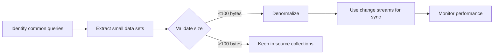

## Data Modeling: Schema Design

In the world of MongoDB, **schema design** is the art of balancing flexibility and performance. 🌟 This section dives into two critical aspects: **embedding vs referencing** and **denormalization**. Understanding these concepts will help you build efficient, scalable applications that leverage MongoDB's strengths.

### Embedding vs Referencing

The choice between embedding and referencing fundamentally shapes your MongoDB application's performance and data structure. Let's break down the differences with concrete examples.

**Embedding** stores related data within a single document. This approach excels when:
- The relationship is **one-to-many**
- Related data is small (≤10 items)
- You frequently need to access the related data together

**Referencing** stores a document ID in a separate collection. This approach shines when:
- The relationship is **many-to-many**
- Related data is large (thousands of items)
- You need to share data across multiple documents

Here's a practical e-commerce scenario to illustrate both approaches:

#### Embedding Example: User with Embedded Orders
```javascript
// users collection with embedded orders
{
  _id: ObjectId("5f8b7d3e4a1b2c3d4e5f6a7b"),
  name: "Alex Johnson",
  email: "alex.j@example.com",
  orders: [
    {
      _id: ObjectId("5f8b7d3e4a1b2c3d4e5f6a7c"),
      product: "Wireless Mouse",
      price: 24.99,
      date: new Date("2023-10-05")
    },
    {
      _id: ObjectId("5f8b7d3e4a1b2c3d4e5f6a7d"),
      product: "Keyboard",
      price: 49.99,
      date: new Date("2023-10-05")
    }
  ]
}
```

#### Referencing Example: User with Order References
```javascript
// users collection with order references
{
  _id: ObjectId("5f8b7d3e4a1b2c3d4e5f6a7b"),
  name: "Alex Johnson",
  email: "alex.j@example.com",
  orders: [
    ObjectId("5f8b7d3e4a1b2c3d4e5f6a7c"),
    ObjectId("5f8b7d3e4a1b2c3d4e5f6a7d")
  ]
}
```

| **Aspect**               | **Embedding**                                  | **Referencing**                              |
|--------------------------|-----------------------------------------------|----------------------------------------------|
| **Use Case**             | Small, frequently accessed related data       | Large datasets or shared data across docs    |
| **Query Performance**    | Fast (single document read)                   | Slower (requires 2+ queries)                |
| **Data Consistency**     | Higher (no network roundtrips)                | Lower (potential for stale data)            |
| **Document Size**        | Larger (if embedded data grows)              | Smaller (only references)                  |
| **Scalability Impact**   | Good for read-heavy apps with small data      | Better for write-heavy apps with large data |

**When to choose embedding?**
- When you need to display related data in a single query (e.g., user + their recent orders)
- When the "many" side has ≤10 items
- When you want to avoid network latency for small datasets

**When to choose referencing?**
- When the "many" side has thousands of items
- When you need to share the same data across multiple collections (e.g., product IDs in orders, users, and cart)
- When you want to maintain strict data consistency through application-level logic

> 💡 **Key Insight**: Embedding is a **read optimization** for small datasets, while referencing is a **write optimization** for large-scale systems. Always prioritize your query patterns over document size.

### Denormalization

Denormalization is a strategic technique where you intentionally duplicate data across documents to optimize read performance. Unlike relational databases where denormalization is a trade-off for read speed, MongoDB's document model makes denormalization a natural fit for many use cases.

**Why denormalization matters in MongoDB**:
- MongoDB has **no joins** (unlike relational databases)
- Complex queries often require multiple collection reads
- Denormalization reduces query latency by storing data in a single document

#### Denormalization Example: User Profile with Address
```javascript
// User document with denormalized address
{
  _id: ObjectId("5f8b7d3e4a1b2c3d4e5f6a7e"),
  name: "Sarah Chen",
  email: "sarah.c@example.com",
  address: {
    street: "456 Innovation Lane",
    city: "San Francisco",
    state: "CA",
    postalCode: "94107"
  }
}
```

**How this helps**:
1. No extra query needed to get user + address
2. Eliminates network latency for common user profile views
3. Simplifies application logic (no join operations)

**When to denormalize**:
1. **Common query patterns**: When your application frequently retrieves data from multiple collections
2. **Small data sets**: Denormalized fields should be ≤100 bytes to avoid excessive storage
3. **Real-time consistency**: When you can update denormalized data via change streams (e.g., address updates)

**Denormalization trade-offs**:
| **Pros**                          | **Cons**                          |
|------------------------------------|------------------------------------|
| 30-50% faster read queries        | Higher storage costs              |
| Simplified application logic      | Potential data drift (outdated data) |
| Eliminates join operations        | Harder to maintain when schema changes |

**Best practice for denormalization**:


> 💡 **Critical note**: Denormalized data should be updated via **change streams** or **application-level triggers**, not manual updates. This ensures consistency without sacrificing performance.

### Summary

In this section, we explored two critical aspects of MongoDB schema design:

- **Embedding** is ideal for small, frequently accessed related data (e.g., user + recent orders)
- **Referencing** is better for large datasets or shared data across collections
- **Denormalization** optimizes read performance by duplicating small data sets in single documents

By strategically applying these techniques, you can build high-performance MongoDB applications that scale with your needs while maintaining data consistency. 💡