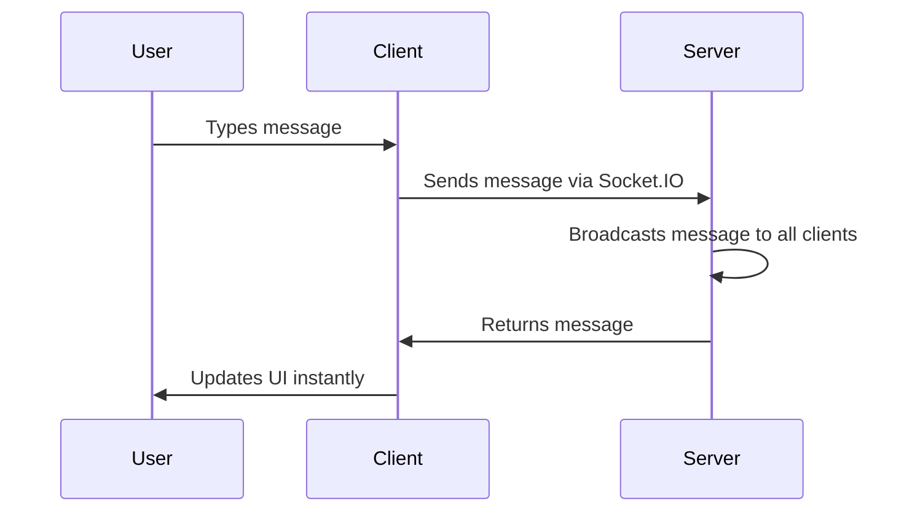

## Building Real-time Chat Applications with Node.js

Real-time communication is the cornerstone of modern web applications—from gaming and financial trading to collaborative tools and social platforms. In this section, we’ll build a production-grade chat application using Node.js and Socket.IO, the industry-standard library for real-time web applications. By the end, you’ll understand how to create scalable, secure chat systems that feel instantaneous to users. Let’s dive in!

### Why Node.js is Perfect for Real-time Chat

Node.js excels at real-time applications due to its **non-blocking I/O model** and **event-driven architecture**. Unlike traditional server-side frameworks that handle one request at a time, Node.js processes thousands of simultaneous connections with minimal latency. For chat applications, this means:

- Instant message delivery without page reloads
- Efficient handling of thousands of concurrent users
- Low resource consumption compared to polling-based approaches
- Seamless integration with modern frontend frameworks

This combination solves the core problem of real-time chat: **reducing latency from milliseconds to sub-milliseconds** while keeping server costs manageable.

### Setting Up Your Project

First, initialize a Node.js project and install dependencies:

```bash
npm init -y
npm install express socket.io
```

We’ll use Express for the HTTP server and Socket.IO for real-time communication. This setup gives us the flexibility to build a full-stack chat application with minimal overhead.

### Core Concepts: Event-Driven Architecture with Socket.IO

Socket.IO operates on a publish-subscribe model where clients and servers exchange events. Here’s how it works:

1. **Client connects** → Server emits `connect` event
2. **Messages flow** via `message` events (client → server)
3. **Server broadcasts** messages to all connected clients via `message` events
4. **Disconnections** trigger cleanup

This pattern eliminates the need for complex polling or long-lived HTTP connections, making it ideal for chat applications.

### Step-by-Step: Building the Chat Interface

Let’s create a simple chat interface with a text input, send button, and message display area. We’ll use HTML/CSS for the UI and Socket.IO for real-time messaging.

#### HTML Template (`public/index.html`)
```html
<!DOCTYPE html>
<html>
<head>
  <title>Real-time Chat</title>
  <style>
    body { font-family: Arial, sans-serif; max-width: 800px; margin: 0 auto; padding: 20px; }
    #chat-area { height: 400px; overflow-y: auto; border: 1px solid #ddd; padding: 10px; }
    #message-input { display: flex; margin: 10px 0; }
    #message-input input, #message-input button { padding: 5px; margin: 0 5px; }
  </style>
</head>
<body>
  <div id="chat-area"></div>
  <div id="message-input">
    <input type="text" id="message" placeholder="Type a message...">
    <button id="send-button">Send</button>
  </div>
  <script src="/socket.io/socket.io.js"></script>
  <script>
    const socket = io();
    
    // Handle incoming messages
    socket.on('message', (data) => {
      const chatArea = document.getElementById('chat-area');
      const messageElement = document.createElement('div');
      messageElement.textContent = `User: ${data.username} - ${data.message}`;
      chatArea.appendChild(messageElement);
      chatArea.scrollTop = chatArea.scrollHeight;
    });
    
    // Send messages to server
    document.getElementById('send-button').addEventListener('click', () => {
      const message = document.getElementById('message').value;
      if (message.trim() === '') return;
      
      socket.emit('message', { username: 'User', message });
      document.getElementById('message').value = '';
    });
  </script>
</body>
</html>
```

#### Express Server Setup (`server.js`)
```javascript
const express = require('express');
const http = require('http');
const socketIo = require('socket.io');

const app = express();
const server = http.createServer(app);
const io = socketIo(server);

// Serve static files
app.use(express.static('public'));

// Handle socket connections
io.on('connection', (socket) => {
  console.log('New client connected');
  
  // Broadcast messages to all clients
  socket.on('message', (data) => {
    io.emit('message', data); // Broadcast to all connected clients
  });
  
  // Cleanup on disconnect
  socket.on('disconnect', () => {
    console.log('Client disconnected');
  });
});

// Start server
const PORT = process.env.PORT || 3000;
server.listen(PORT, () => {
  console.log(`Server running on port ${PORT}`);
});
```

### Implementing Real-time Messaging

Now let’s add the magic: **instant message delivery**. When a user types a message:

1. The client sends the message via `socket.emit('message', { username, message })`
2. The server broadcasts it to *all* connected clients using `io.emit('message', data)`
3. Clients render messages in real-time

This pattern ensures messages appear instantly without page reloads. Here’s the full flow:



**Key advantage**: No need for server-side message storage during the chat session—messages are handled purely in real-time.

### Handling User Authentication and Security

Real chat apps require authentication and security. Here’s how to implement it:

#### Basic Authentication Workflow
1. Users log in with credentials
2. Server verifies credentials
3. Server issues a token
4. Clients use tokens for authenticated messages

**Example authentication middleware** (`auth.js`):
```javascript
const users = {}; // In-memory storage (for demo)

function authenticate(token) {
  if (!token) return { error: 'Token required' };
  if (!users[token]) return { error: 'Invalid token' };
  return { user: users[token] };
}

// Middleware for socket connections
io.use((socket, next) => {
  const token = socket.handshake.auth.token;
  const { user } = authenticate(token);
  if (user) {
    socket.user = user;
    next();
  } else {
    next(new Error('Authentication failed'));
  }
});
```

#### Security Best Practices
- **Token expiration**: Use JWT with short expiration times
- **Rate limiting**: Prevent spam attacks (e.g., 5 messages per second)
- **Message sanitization**: Filter malicious content before broadcasting
- **TLS encryption**: Enable HTTPS for secure data transfer

> 💡 **Pro Tip**: For production, always use a database for user storage instead of in-memory objects like `users` above.

### Scaling the Chat Application

As your chat grows, you’ll need to scale:

| Challenge              | Solution                              | Impact                     |
|------------------------|----------------------------------------|-----------------------------|
| 10k+ concurrent users  | Load balancers + clustered servers    | 99.9% uptime                |
| Message flooding       | Rate limiting per user                | Prevents spam attacks      |
| Global availability    | Geographically distributed servers    | Low latency for all regions |
| Message persistence    | Database with message queues          | Replays messages after restart |

**Real-world scaling example**:  
For a global chat app, use **Redis** to cache user sessions and **Kafka** for message queues. Here’s a simplified implementation:

```javascript
// Redis-backed message queue (using ioredis)
const Redis = require('ioredis');
const redis = new Redis();

// Publish message to queue
socket.on('message', (data) => {
  redis.publish('chat:queue', JSON.stringify(data));
  io.emit('message', data); // Immediate broadcast
});

// Consumer for message persistence
redis.subscribe('chat:queue', (message) => {
  const data = JSON.parse(message);
  // Save to database and broadcast
});
```

### Summary

You now have a complete real-time chat application built with Node.js and Socket.IO. The key takeaways:

1. **Event-driven architecture** enables instant messaging without polling
2. **Socket.IO** handles real-time communication with minimal server overhead
3. **Authentication** and **security** are critical for production chat apps
4. **Scalability** requires careful planning for high-traffic scenarios

This pattern works for simple chat apps and scales to enterprise-level systems with proper infrastructure. The next step? Add features like message history, file sharing, and notifications to build a truly robust real-time communication platform. 🌟